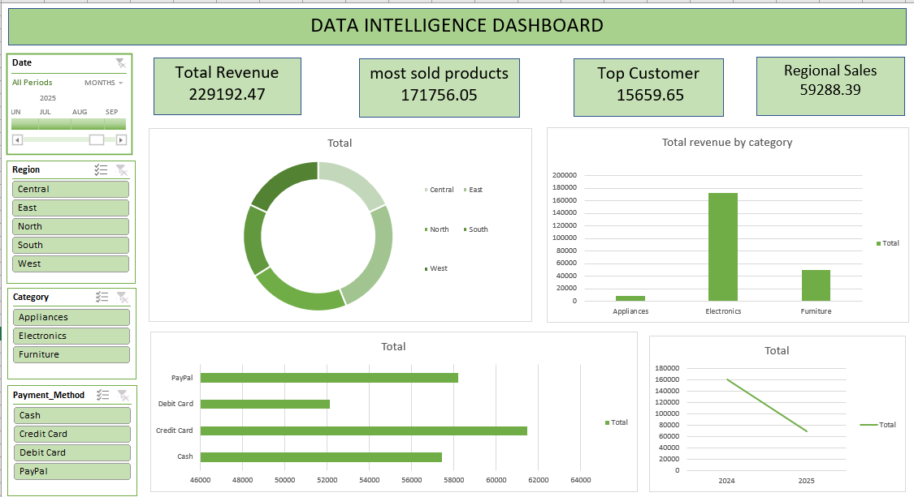

# 📊 Data Intelligence Dashboard Project

An interactive and insightful Excel Dashboard built to analyze sales performance, revenue trends, customer behavior, and business KPIs across multiple regions, categories, and payment methods.

---

## 🚀 Project Overview

This project presents a dynamic **Data Intelligence Dashboard** created using Microsoft Excel. It provides a structured and visually appealing way to analyze:

- 💰 **Total Revenue** — $229,192.47 across all periods
- 🛒 **Most Sold Products Revenue** — $171,756.05
- 👑 **Top Customer** — $15,659.65 (Mark Carter)
- 🌍 **Regional Sales** — $59,288.39 (highest region)
- 📦 **Product Categories** — Electronics, Appliances, Furniture
- 💳 **Payment Methods** — Cash, Credit Card, Debit Card, PayPal

The dashboard helps businesses make **data-driven decisions** through KPI tracking, interactive slicers, and dynamic visualizations.

---

## 🗂️ Project Files

| File Name | Description |
|---|---|
| 📄 `data_intelligence.xlsx` | Main Excel dashboard file |
| 🖼️ `dashboard_preview.png` | Screenshot of the dashboard |
| 📘 `README.md` | Project documentation |

---

## 📁 Excel File Explanation

The workbook `data_intelligence.xlsx` contains **4 sheets**, each serving a specific role:

| Sheet | Description |
|---|---|
| `raw data` | Original 250 transaction records (Apr 2024 – Apr 2025) with 14 columns including Transaction ID, Date, Customer, Product, Category, Quantity, Unit Price, Payment Method, Region, and Total Amount |
| `clean data` | Cleaned and formatted version of the raw data, used as the source for pivot analysis |
| `pivot table` | Aggregated summaries — revenue by category, top products, top customers, and most sold items |
| `dashboards` | Interactive visual dashboard with KPI cards, charts, and slicers |

---

## 🧩 Dashboard Structure

### 🔹 1️⃣ KPI Cards (Top Section)

| KPI | Value |
|---|---|
| 💰 Total Revenue | $229,192.47 |
| 🛒 Most Sold Products | $171,756.05 |
| 👑 Top Customer | $15,659.65 |
| 🌍 Regional Sales | $59,288.39 |

These KPI cards provide a quick executive snapshot of overall business performance.

---

### 🔹 2️⃣ Sales Analysis Section

| Chart | Type | Insight |
|---|---|---|
| 🥧 Region Distribution | Donut Chart | Shows revenue split across Central, East, North, South, West |
| 📊 Revenue by Category | Bar Chart | Compares Electronics vs Appliances vs Furniture |
| 💳 Revenue by Payment Method | Horizontal Bar Chart | Tracks Cash, Credit Card, Debit Card, PayPal usage |
| 📈 Revenue Trend Over Time | Line Chart | Visualizes performance across 2024–2025 |

---

### 🔹 3️⃣ Interactive Filters (Slicers)

| Slicer | Options |
|---|---|
| 📅 Date | Filter by month/year (2024–2025) |
| 🌎 Region | Central, East, North, South, West |
| 📦 Category | Appliances, Electronics, Furniture |
| 💳 Payment Method | Cash, Credit Card, Debit Card, PayPal |

Users can **dynamically filter** and slice the data to analyze specific segments in real time.

---

## 📋 Dataset Overview

- **Total Records:** 250 transactions
- **Date Range:** April 2024 – April 2025
- **Customer Segments:** Basic, Standard, Premium
- **Regions:** Central, East, North, South, West
- **Product Categories:** Electronics, Appliances, Furniture
- **Payment Methods:** Cash, Credit Card, Debit Card, PayPal

---

## 🗃️ Workbook Sheets

| Sheet Name | Purpose |
|---|---|
| `raw data` | Original unprocessed transaction records |
| `clean data` | Cleaned and formatted dataset ready for analysis |
| `pivot table` | Aggregated pivot summaries (revenue by category, top products, etc.) |
| `dashboards` | Interactive visual dashboard with KPIs, charts, and slicers |

---

## 🛠️ Tools & Technologies Used

| Sheet | Features Used |
|---|---|
| `raw data` | Data entry, date formatting, text & number data types |
| `clean data` | Data cleaning, removing duplicates, `TEXT()`, `IF()`, `TRIM()` formulas |
| `pivot table` | Pivot Tables, grouping, aggregation (SUM, COUNT), sorting & filtering |
| `dashboards` | Pivot Charts (Donut, Bar, Line), Slicers, KPI Cards, Conditional Formatting, linked cells |

---

## 📷 Dashboard Preview

The dashboard features a clean **green-themed** design with:
- 4 KPI summary cards at the top
- A regional donut chart for geographic breakdown
- A category bar chart showing Electronics dominance
- A payment method horizontal bar for transaction preferences
- A time-series line chart tracking revenue trends year-over-year

---

## 📌 Key Insights Derived

✔️ **Electronics** is the top-performing category by revenue
✔️ **Credit Card** and **PayPal** are the most preferred payment methods
✔️ Revenue peaked in **2024** with a declining trend towards 2025 (seasonal or market shift)
✔️ **Mark Carter** is the highest-value customer at $15,659.65
✔️ All 5 regions contribute measurably — no single region is negligible
✔️ **Premium** customers drive disproportionate revenue vs Basic/Standard segments

---

## 🎯 Business Use Cases

- 📊 Sales Performance Monitoring
- 🏢 Business Intelligence Reporting
- 📋 Executive Summary Dashboard
- 🛍️ Customer Behavior Analysis
- 📦 Inventory & Product Planning
- 💳 Payment Channel Optimization

---

## 📈 How to Use

1. Download the repository
2. Open `data_intelligence.xlsx` in Microsoft Excel
3. Enable editing (if prompted)
4. Navigate to the **Dashboards** sheet
5. Use the **slicers** on the left panel to filter by:
   - Date range
   - Region
   - Category
   - Payment Method
6. All charts and KPI cards update dynamically based on your selection

---

## 🌟 Future Enhancements

- [ ] Power BI Version of the Dashboard
- [ ] Automated Monthly Data Refresh
- [ ] Python-based Data Pipeline (pandas + openpyxl)
- [ ] Revenue Forecasting Module
- [ ] Customer Lifetime Value (CLV) Analysis
- [ ] Email-based Automated Reports

---

## 👨‍💻 Shruti Bhawsar

📍 Ahemdabad

---

## ⭐ If You Like This Project

Give this repository a ⭐ and feel free to fork or contribute!

> 📊 *Turning Raw Data into Actionable Insights*
